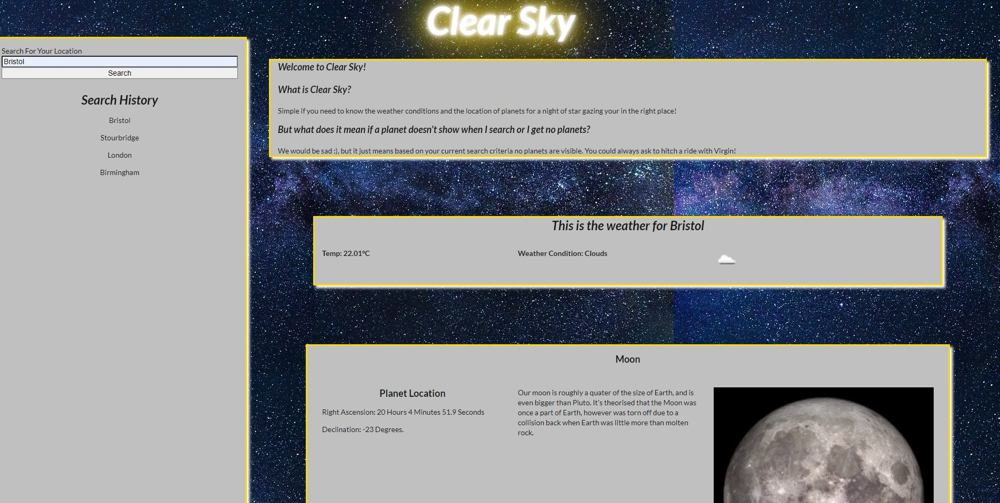

# AstronomyGroupProject

## Link To Project

[Deployed Site](https://cleggatron.github.io/ClearSky/)

## Screenshot Of Project

## Description

Our motivation for this project was to make a website as group in order to aquire a basic understanding of how coding in a team would work in the industry. We decided on a multi-Api website that aquired planetary and weather data.

Over the course of this project we have all learned a great deal about code conflict management, how to delegate tasks correctly, how to merge different branches, and how to effectively use gitbash.

## Installation

For the source code follow these steps:

1: Download repository from github
2: Save where desired
3: Open file using a text editor of your choice

For the website iself follow these steps:

1: Follow link provided in this repository

## Usage

The way you use this website is as follows:

1: Type in a city of your choice in the search bar.
2: Then the weather conditions of that location will show, telling you if it decent weather to go out stargazing.
3: A list of planets that would be visible to you are also shown underneath the weather, as well as their location, and some      information about them.
4: The location the user inputted will be added to the search history underneath the search bar, as well as saved to local storage. Refreshing the page would still keep the previously searched locations present.
5: Clicking on any of the locations in the search history will bring up weather and visible planet data for that location.
6: Should the user leave the search bar blank, or enter a location that isn't a city they will get a message asking them to do so.

## Credits

The weather API we used in this project was gained from OpenWeather, the API is known as One Call API. 
Here is a link to the site:

https://openweathermap.org/api/one-call-api

For the planetary data we used the Visible Planets API.
Here is a link to their github repo:

https://github.com/csymlstd/visible-planets-api

We also used a framework called Semantic UI.
Here is a link to their website:

https://semantic-ui.com/elements/container.html#/examples

## License

MIT License

Copyright (c) [2021] [Matthew Walford, Georgia Hobson, David Clegg]

Permission is hereby granted, free of charge, to any person obtaining a copy of this software and associated documentation files (the "Software"), to deal in the Software without restriction, including without limitation the rights to use, copy, modify, merge, publish, distribute, sublicense, and/or sell copies of the Software, and to permit persons to whom the Software is furnished to do so, subject to the following conditions:

The above copyright notice and this permission notice shall be included in all copies or substantial portions of the Software.

THE SOFTWARE IS PROVIDED "AS IS", WITHOUT WARRANTY OF ANY KIND, EXPRESS OR IMPLIED, INCLUDING BUT NOT LIMITED TO THE WARRANTIES OF MERCHANTABILITY, FITNESS FOR A PARTICULAR PURPOSE AND NONINFRINGEMENT. IN NO EVENT SHALL THE AUTHORS OR COPYRIGHT HOLDERS BE LIABLE FOR ANY CLAIM, DAMAGES OR OTHER LIABILITY, WHETHER IN AN ACTION OF CONTRACT, TORT OR OTHERWISE, ARISING FROM, OUT OF OR IN CONNECTION WITH THE SOFTWARE OR THE USE OR OTHER DEALINGS IN THE SOFTWARE.
